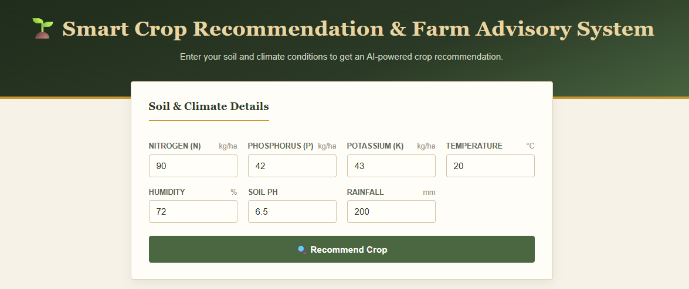
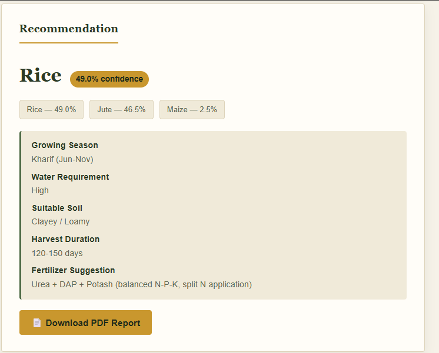
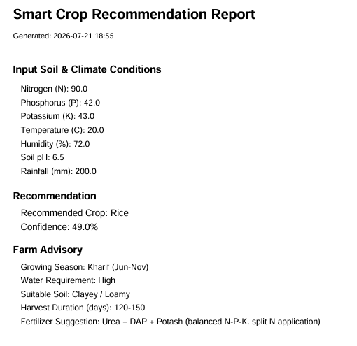

# 🌱 Smart Crop Recommendation & Farm Advisory System

> An AI-powered web application developed as part of the **Machine Learning Summer Internship at Krishna Path Incubation Society (TBI-KIET)**. The system recommends the most suitable crop based on soil nutrients and climatic conditions using Machine Learning and provides farming advisory information with a downloadable PDF report.


---

## 📌 Project Overview

Agriculture plays a vital role in food production, but selecting the right crop remains a challenge for many farmers. Traditional crop selection methods often rely on experience rather than data, leading to poor yield and inefficient use of resources.

This project uses **Machine Learning** to recommend the most suitable crop based on:

- Nitrogen (N)
- Phosphorus (P)
- Potassium (K)
- Temperature
- Humidity
- Soil pH
- Rainfall

Along with crop prediction, the system also provides:

- Crop advisory
- Fertilizer suggestion
- Growing season
- Water requirement
- Harvest duration
- Downloadable PDF report

---

# 🎯 Problem Statement

Farmers often face difficulty selecting the best crop because soil nutrients and environmental conditions vary from place to place.

Incorrect crop selection can lead to:

- Low agricultural productivity
- Higher fertilizer costs
- Water wastage
- Financial loss

The objective of this project is to assist farmers by using Machine Learning to recommend the most suitable crop based on soil and climate parameters.

---

# ✨ Features

- 🌱 AI-powered crop recommendation
- 📊 Top-3 crop predictions with confidence score
- 🌾 Crop advisory
- 💧 Fertilizer recommendation
- 🌦 Growing season information
- ⏳ Harvest duration
- 📄 PDF report generation
- ⚡ FastAPI REST API
- ☁️ Cloud deployment
- 📱 Responsive frontend

---

# 📷 Screenshots

## Home Page



---

## Prediction Result



---

## PDF Report



---

# 🧠 Machine Learning Workflow

1. Load Dataset
2. Data Preprocessing
3. Train Multiple ML Models
4. Compare Performance
5. Select Best Model
6. Save Trained Model
7. Predict Crop
8. Generate Farm Advisory
9. Download PDF Report

---

# 📂 Dataset

**Dataset Name**

Crop Recommendation Dataset

**Source**

Kaggle

https://www.kaggle.com/datasets/atharvaingle/crop-recommendation-dataset

**Dataset Details**

- Records : 2200
- Crop Classes : 22
- Features : 7
- Target : Crop Label

---

# 📊 Input Features

| Feature | Description |
|----------|-------------|
| N | Nitrogen |
| P | Phosphorus |
| K | Potassium |
| Temperature | Temperature (°C) |
| Humidity | Relative Humidity (%) |
| pH | Soil pH |
| Rainfall | Rainfall (mm) |

---

# 🤖 Machine Learning Models

The following models were trained and compared:

- Logistic Regression
- Gradient Boosting Classifier
- Random Forest Classifier

The best-performing model was selected and saved for deployment.

---

# 📈 Model Performance

| Model | Accuracy |
|--------|----------|
| Logistic Regression | 95% |
| Gradient Boosting | 98.8% |
| Random Forest | **99.5%** |

---

# 🏗️ System Architecture

```
              User

                │

                ▼

     HTML + CSS + JavaScript

                │

                ▼

         FastAPI Backend

                │

                ▼

      Trained ML Model (.pkl)

                │

                ▼

      Crop Recommendation

                │

                ▼

 Farm Advisory + PDF Report
```

---

# 🛠 Tech Stack

## Frontend

- HTML5
- CSS3
- JavaScript

## Backend

- FastAPI
- Pydantic

## Machine Learning

- Scikit-Learn
- Random Forest
- Logistic Regression
- Gradient Boosting

## Libraries

- Pandas
- NumPy
- Joblib
- ReportLab

## Deployment

- Render
- Vercel

---

# 📁 Project Structure

```
crop-recommendation/

├── assets/
|   ├── Home.png
│   ├── Prediction.png
│   └── Report.png

├── backend/
│   ├── crop_info.py
│   ├── label_encoder.pkl
│   ├── main.py
│   ├── model.pkl
|   ├── requirements.txt
│   └── runtime.txt

├── data/
│   └── Crop_recommendation.csv

├── frontend/
│   ├── index.html
│   ├── script.js
│   └── style.css

├── model/
│   └── train_model.py

├── .gitignore

└── README.md
```

---

# 🚀 Installation

## Clone Repository

```bash
git clone https://github.com/faisalkhan02/smart-crop-recommendation-system.git

cd smart-crop-recommendation-system
```

---

## Install Dependencies

```bash
pip install -r backend/requirements.txt
```

---

## Train the Model

```bash
cd model

python train_model.py
```

---

## Run Backend

```bash
cd backend

uvicorn main:app --reload
```

Backend

```
http://127.0.0.1:8000
```

API Documentation

```
http://127.0.0.1:8000/docs
```

---

## Run Frontend

Open

```
frontend/index.html
```

or use Live Server.

---

# 🌐 Live Demo

**Frontend**

https://smart-crop-recommendation-system-nu.vercel.app/

**Backend**

https://smart-crop-recommendation-system-jdj4.onrender.com

**API Docs**

https://smart-crop-recommendation-system-jdj4.onrender.com/docs

---

# 📡 API Endpoints

| Method | Endpoint | Description |
|---------|----------|-------------|
| POST | /predict | Predict Crop |
| GET | /crop-info/{crop} | Crop Advisory |
| POST | /report | Generate PDF Report |

---

# 💡 Engineering Justification

### Why Machine Learning?

Crop recommendation depends on multiple environmental factors that interact in complex ways. A Machine Learning model can learn these relationships more effectively than traditional rule-based approaches.

### Why Random Forest?

- High accuracy
- Handles nonlinear relationships
- Robust against overfitting
- Works well with tabular datasets
- No feature scaling required

### Why FastAPI?

- High performance
- Automatic API documentation
- Easy deployment
- Built-in validation

---

# 🔮 Future Scope

- Weather API integration
- Soil sensor integration
- Fertilizer quantity prediction
- Mobile application
- Multi-language support
- GPS-based recommendations

---

# 👨‍💻 Internship

This project was developed as the **Major Project** during the **Machine Learning Summer Internship** conducted by **Krishna Path Incubation Society (TBI-KIET)** in association with **AI Club, KIET Group of Institutions**.

---

# 👨‍💻 Author

**Faisal Khan**

MCA Student

Machine Learning Intern

---

# 🙏 Acknowledgements

- KIET Technology Business Incubator (KIET TBI)
- AI Club, KIET
- Kaggle Crop Recommendation Dataset
- FastAPI
- Scikit-Learn
- ReportLab

---

# 🤝 Academic Integrity

The dataset used in this project is sourced from Kaggle and properly
attributed above. AI assistance (Claude by Anthropic and ChatGPT by
OpenAI) was used during development to help generate code structure,
debug deployment issues, and write documentation. All code was reviewed,
tested, and understood before submission. No external code repositories
or notebooks were copied.

---

# 📜 License

This project has been developed for **academic and educational purposes** as part of a Machine Learning Internship.

---

⭐ If you found this project useful, consider giving it a star.